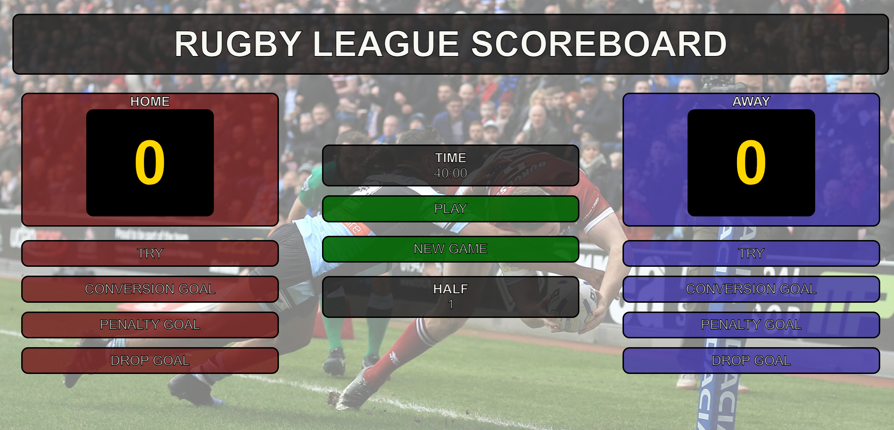

# Rugby League Scoreboard

A responsive, interactive Rugby League scoreboard designed to track the match score, time, and game progression. This project allows users to simulate scoring events and monitor the remaining time in a match, including tries, conversions, penalty goals, and drop goals for both home and away teams.

## Project Links

- **Live Site**: [Rugby League Scoreboard](https://rugby-league-scoreboard.netlify.app/)
- **Design Mockup**: [Figma Design](https://www.figma.com/design/3oyWBlaqcQH9prHAKAxEIg/Scrimba-Scoreboard?node-id=0-1&node-type=canvas&t=FENOrRtIonu2hyl5-0)

## Features

- **Real-time Score Tracking**: Easily track scores for both home and away teams with buttons for various scoring methods (tries, conversions, penalties, and drop goals).
- **Timer Functionality**: The game clock counts down from 40 minutes, representing one half of a Rugby League match. You can start, pause, and reset the timer.
- **Half-Time Indicator**: The game progresses from the first half to the second half automatically when the timer resets.
- **New Game Button**: Resets all scores, the timer, and the half-time indicator, starting a fresh game.
- **Accessibility Support**: Screen readers are supported, and the scoreboard updates dynamically for those relying on assistive technologies.

## Installation

To run this project locally, follow these steps:

1. Clone the repository:
    ```bash
    git clone https://github.com/yourusername/rugby-league-scoreboard.git
    ```
2. Navigate to the project directory:
    ```bash
    cd rugby-league-scoreboard
    ```
3. Open the `index.html` file in your browser to view the scoreboard.

No additional setup is required beyond cloning the project. The scoreboard uses vanilla HTML, CSS, and JavaScript.

## Usage

### Scoring Events:
- **Home Team**:
  - Try: +4 points
  - Conversion Goal: +2 points
  - Penalty Goal: +2 points
  - Drop Goal: +1 point
- **Away Team**:
  - Try: +4 points
  - Conversion Goal: +2 points
  - Penalty Goal: +2 points
  - Drop Goal: +1 point

### Timer:
- The timer automatically starts at 40 minutes and counts down.
- Press **PLAY/PAUSE** to start or stop the timer.
- Use **NEW GAME** to reset the timer, scores, and half.

## Code Overview

The project uses three main files:

1. **HTML**: Defines the structure of the scoreboard and buttons for user interaction.
2. **CSS**: Styles the layout, ensuring responsiveness across different screen sizes.
3. **JavaScript**:
    - Handles the scoring logic for both teams.
    - Manages the game timer and half progression.
    - Supports starting a new game and resetting states.

### JavaScript Example

The scoring logic is straightforward. Here's an example of the function for a home team's try:

```javascript
function homeTry() {
    countHome += 4;
    scoreHome.textContent = countHome;
}
```

The timer is initialised when the page loads:

```javascript
window.onload = function() {
    startTimer(remainingTime, timeDisplay);
}
```

## Screenshots



## Accessibility

- All interactive elements are labeled with ARIA attributes for screen readers.
- Dynamic updates to the scoreboard and timer are announced for assistive technology users.

## Future Improvements

- Add a settings option to customise the game length or modify score values for each event.
- Implement sound effects for scoring and time events.

## License

This project is open-source and available under the [MIT License](LICENSE).
